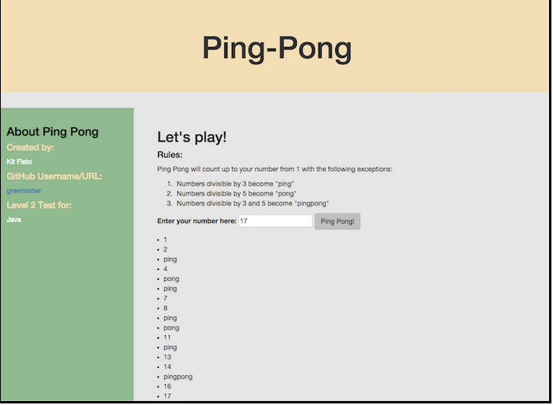

#Ping Pong Assessment

##Epicodus week 3 code review

###By: Jordan Meier

###Description
This week's code review project is a website where a user can input a number and have a range of numbers from 1 to their entered number returned in a list. Numbers divisible by 3 are replaced with the word "ping", numbers divisible by 5 are replaced with "pong", and numbers divisible by both are replaced with "pingpong". I opted to attempt to recreate the pictured example layout without using bootstrap.

###Known Bugs
No known bugs at this time.

###Contact Me
For questions or suggestions, feel free to contact me on GitHub!

###Instalation Instructions
You can clone this repo onto your desktop and open the index.html, or go to jordan-meier.github.io/ping-pong.

###Technologies Used:

* HTML
* CSS
* jQuery
* JavaScript
* Mocha 2.3.4
* Chai 3.4.2

###Copyright & Licensing

*This software is licensed under the MIT license.*

© Copyright 2016 Jordan Meier
